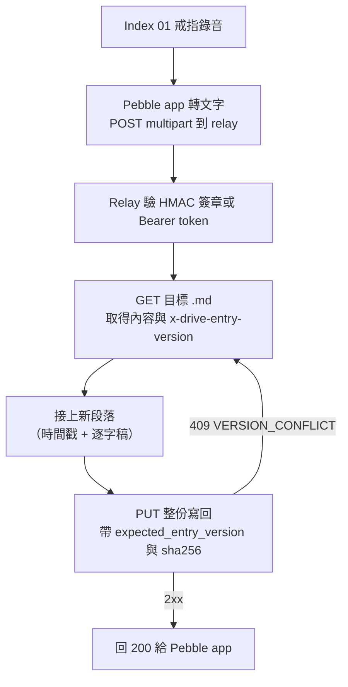

# Pebble Index 逐字稿 → WSPC Drive：可行性調查

> 調查日期：2026-09-29。全部依據官方文件、官方 OpenAPI 與官方 GitHub 原始碼，每一點都附來源。

**背景**：Pebble Index 01 是 Core Devices（Pebble 的新東家）出的一只錄音戒指。按住戒指上的按鈕說話，錄音會同步到手機上的 Pebble app，在那裡轉成文字，再依照設定交給 AI 代理人處理或送到外部服務（[repebble.com/index](https://repebble.com/index)）。WSPC 是一套給 AI 代理人用的工作空間後端，提供 Email、行事曆、待辦與 Drive；Drive 以「library」為單位存放檔案，每個 library 裡的檔案用相對路徑（例如 `notes/today.md`）來識別（[wspc.ai/llms.txt](https://wspc.ai/llms.txt)）。

**結論：有條件可行，而且中間需要一個小 relay。** 兩邊該有的零件都有：Pebble app 有官方的 outgoing webhook，會把逐字稿以純文字送出；WSPC Drive 有公開 REST API，可用長期 API key 建立或覆寫某個 library 裡指定路徑的 .md 檔。但兩邊**沒辦法直接對接**：Pebble 只會送 `POST` + `multipart/form-data`，而 WSPC 寫檔要用 `PUT` 送原始 bytes（或用 JSON 呼叫 edit），格式與方法都對不上。另外 WSPC **沒有 append API**，要「接在同一個 .md 後面」只能讀出來、接上、再整份寫回（靠版本號擋衝突），或用字串取代 API 繞一下。

---

## 名詞

- **Index 01**：Pebble 的錄音戒指，本文的「Pebble Index」。
- **Pebble app**：Core Devices 的開源手機 app（iOS／Android），負責收錄音、轉文字、發 webhook。
- **Library**：WSPC Drive 裡的檔案容器，屬於某個 Workspace（組織）。
- **Entry Version**：WSPC Drive 每個檔案的整數版本號，寫檔時拿來做樂觀鎖（optimistic locking，版本對不上就拒絕寫入）。
- **Relay**：夾在中間、負責轉格式與代打 API 的小服務，例如一支 Cloudflare Worker。

---

## Pebble Index 端

### 1. Pebble Index 是什麼

- Pebble Index 01 是一只智慧戒指，定位是「大腦的外接記憶」；只在按下按鈕時錄音，不會一直聽。預購價 $75（之後 $99），2026 年 3 月開始出貨。來源：[repebble.com/index](https://repebble.com/index)、[官方部落格](https://repebble.com/blog/meet-pebble-index-01-external-memory-for-your-brain)
- 錄音存在戒指上（總共約 5 分鐘容量），**單次錄音上限約 2 分鐘**，回到手機藍牙範圍內再同步。來源：[Getting Started Guide](https://help.repebble.com/en/articles/15434751-index-01-getting-started-guide)
- 手機 app 是開源的：[github.com/coredevices/mobileapp](https://github.com/coredevices/mobileapp)。

### 2. 有沒有逐字稿、長什麼樣子

- 有。轉文字在手機上發生，可選 Cloud Only、Local Only（需下載約 670MB 模型）或兩者互相備援。來源：[Getting Started Guide](https://help.repebble.com/en/articles/15434751-index-01-getting-started-guide)
- webhook 送出的 `transcription` 欄位是**一段純文字**（"Plain text transcription of the recording"）。文件沒有提到時間軸分段、講者標記，也沒有 JSON 結構或 markdown。另外附一個 `recordedAt`（錄音時間，Unix 毫秒）。來源：[INDEX_WEBHOOK_API.md](https://github.com/coredevices/mobileapp/blob/master/experimental/src/commonMain/kotlin/coredevices/ring/external/indexwebhook/INDEX_WEBHOOK_API.md)

### 3. Webhook 與其他整合

**有官方 webhook。** 使用者文件在 [Index Advanced Features (MCP, Webhook)](https://help.repebble.com/en/articles/15724406-index-advanced-features-mcp-webhook)，完整的協定規格在 app 原始碼裡的 [INDEX_WEBHOOK_API.md](https://github.com/coredevices/mobileapp/blob/master/experimental/src/commonMain/kotlin/coredevices/ring/external/indexwebhook/INDEX_WEBHOOK_API.md)。以下都出自這兩份。

- **設定位置**：Index 01 設定裡的 **Webhook**。兩種手勢（**Hold & talk**、**Double click & hold**）各自有一組 URL、headers、送出內容（這是 INDEX_WEBHOOK_API.md 的說法；help center 那篇 2026-07-01 更新的文章還寫著「只能設定一個 webhook」，比 repo 的規格舊）。
- **送出內容**三選一：只送錄音、只送逐字稿、兩者都送。要寫進 .md 選「Transcription only」就好。
- **格式**：`POST <URL>`，`Content-Type: multipart/form-data`。欄位是 `transcription`（純文字）、`recordedAt`（毫秒）、`client`（固定 `"ring"`）、有選錄音時再加 `audio`（16kHz 單聲道 AAC m4a）。
- **自訂 header：可以。** 使用者可加任意 name/value header，每次原封不動送出，官方直接建議放 `Authorization`。只有 `X-Audio-Size`、`X-Index-*` 這幾個系統 header 不能覆蓋。
- **簽章：可選的 HMAC-SHA256。** 開啟「Sign requests」後會帶 `X-Index-Signature`、`X-Index-Timestamp`、`X-Index-Delivery`，簽的是 `"v1\n{timestamp}\n{deliveryId}\n{trigger}\n{0|1}\n"` 接上原始 multipart body。
- **重送：幾乎沒有。** "Failed uploads are retried on the next recording (no persistent retry queue)"，也就是失敗的那筆要等下一次錄音才會再試一次。app 端 HTTP 逾時 2 分鐘、會跟隨 redirect、2xx 才算成功（[IndexWebhookApi.kt](https://github.com/coredevices/mobileapp/blob/master/experimental/src/commonMain/kotlin/coredevices/ring/external/indexwebhook/IndexWebhookApi.kt)）。
- **大小限制**：文件沒寫；純文字逐字稿配上約 2 分鐘的錄音，實際上很小。
- **可測試**：設定畫面有 **Send test event**，會送 `X-Index-Test: true` 和一段固定的 `transcription`。

<details>
<summary>Webhook 請求範例（依官方規格整理，非實際擷取）</summary>

```http
POST https://relay.example.com/pebble
Content-Type: multipart/form-data; boundary=3f1c...
Authorization: Bearer <你自己設定的 token>
X-Index-Webhook-Version: 1
X-Index-Trigger: single-click-hold
X-Index-Signature: 9a0b...（開啟簽章時）
X-Index-Timestamp: 1790000000（開啟簽章時）
X-Index-Delivery: <穩定的 delivery ID>（開啟簽章時）

--3f1c...
Content-Disposition: form-data; name="transcription"

明天記得把報價單寄給客戶。
--3f1c...
Content-Disposition: form-data; name="recordedAt"

1790000000000
--3f1c...
Content-Disposition: form-data; name="client"

ring
--3f1c...--
```

完整的 header 清單、簽章步驟與 Flask 驗章範例見 [INDEX_WEBHOOK_API.md](https://github.com/coredevices/mobileapp/blob/master/experimental/src/commonMain/kotlin/coredevices/ring/external/indexwebhook/INDEX_WEBHOOK_API.md)。
</details>

**其他整合**：

- **MCP**：可以接雲端 MCP server（SSE 或 Streamable HTTP），但**只支援用 `Authorization` header 驗證，不支援 OAuth 登入流程**。來源：[Advanced Features](https://help.repebble.com/en/articles/15724406-index-advanced-features-mcp-webhook)
- **帳號串接**：Google Tasks、Notion 等；錄音詳情頁可播放並匯出錄音。來源：[Getting Started Guide](https://help.repebble.com/en/articles/15434751-index-01-getting-started-guide)
- 沒有找到 Zapier／Make／n8n 的官方整合或公開 REST API（未確認，官方文件沒提到）。

### 4. 如果不用 webhook

不需要，webhook 就是最直接的路。唯一的替代方案是 MCP（見第 10 點），但比較不適合。

---

## WSPC 端

### 5. WSPC／WSPC Drive／library

- WSPC 是 "agent-first productivity backend"，提供 Auth、Todo、Calendar、Email、Drive、Push、Billing 等 REST API。營運公司是 Sad Coder, Inc.。來源：[llms.txt](https://wspc.ai/llms.txt)、[pricing](https://wspc.ai/pricing/)
- Drive 讓 AI「存、整理、找網頁、對話與文件」，建成知識庫；有桌面程式可把 library 同步到本機資料夾。來源：[wspc.ai](https://wspc.ai/)、[llms-full.txt](https://wspc.ai/llms-full.txt)
- **Library** 是「an org-scoped file container」，屬於 Workspace。裡面的檔案以相對路徑識別，**斜線只是路徑的一部分，沒有資料夾這種實體**。來源：[MCP reference（llms-full.txt 的 Drive 段）](https://wspc.ai/llms-full.txt)、[llms-drive.txt](https://wspc.ai/llms-drive.txt)

### 6. 公開 API 與驗證

- REST API：`https://api.wspc.ai`，Drive 的 OpenAPI 在 [api.wspc.ai/drive/openapi.json](https://api.wspc.ai/drive/openapi.json)（官方說 live OpenAPI 是最終依據）。另有 CLI `@wspc/cli`（[AGENTS.md](https://wspc.ai/AGENTS.md)）與 MCP server `https://mcp.wspc.ai/mcp`（[llms-full.txt](https://wspc.ai/llms-full.txt)）。
- **驗證**：REST 接受 OAuth 2.1 access token（4 小時過期、要 refresh）**或長期 API key**，都放在 `Authorization: Bearer`。來源：[llms.txt](https://wspc.ai/llms.txt)、[API Reference](https://wspc.ai/api/)
- API key 用 `POST /auth/keys` 或 `wspc keys create` 建立，明碼只顯示一次，每人最多 25 把有效 key。來源：[auth OpenAPI](https://api.wspc.ai/auth/openapi.json)、[AGENTS.md](https://wspc.ai/AGENTS.md)
- **Scope 只有 `wspc:full`**，等於整個帳號的 root 權限（Email、行事曆、Drive 全包）。沒有「只能寫 Drive」這種較小的權限。來源：[llms.txt](https://wspc.ai/llms.txt)
- MCP 的文件只寫了 OAuth 2.1 流程，**沒寫 MCP 能不能直接用 API key**（未確認）。

### 7. Drive API 能做什麼

| 需求 | 有沒有 | 端點 |
| --- | --- | --- |
| (a) 列出 library | 有 | `GET /drive/libraries`（cursor 分頁） |
| (b) 用路徑找檔案 | 有 | `GET /drive/libraries/{id}/manifest?path_prefix=...` 列出 metadata；或直接 `GET .../files/content?path=...`，不存在會回 `FILE_NOT_FOUND` |
| (c) 建立 .md | 有 | `PUT /drive/libraries/{id}/files/content?path=...&expected_entry_version=0` |
| (d) 覆寫 .md | 有 | 同上，`expected_entry_version` 帶目前版本號 |
| (e) **append** | **沒有** | 只能整份覆寫，或用 `POST .../files/edit` 做字串取代 |

來源：[drive OpenAPI](https://api.wspc.ai/drive/openapi.json)、[llms-drive.txt](https://wspc.ai/llms-drive.txt)

重點細節：

- **上傳是 `PUT`，body 直接放檔案原始 bytes**，"not JSON, multipart, or base64"。Drive 指南要求帶 `x-drive-content-sha256`（body 的小寫 SHA-256 hex），bytes 對不上會回 `HASH_MISMATCH`。回應是 `{ entry, result }`，`result` 為 `created`／`updated`／`unchanged`。來源：[llms-drive.txt](https://wspc.ai/llms-drive.txt)、[drive OpenAPI](https://api.wspc.ai/drive/openapi.json)
- **Edit** 是 `POST /drive/libraries/{id}/files/edit`，JSON body `{ path, old_string, new_string, replace_all? }`，精確比對字串取代；找不到會失敗（MCP 文件寫的是 `EDIT_NO_MATCH`）。body 裡**沒有版本號欄位**。來源：[drive OpenAPI](https://api.wspc.ai/drive/openapi.json)、[llms-full.txt](https://wspc.ai/llms-full.txt)
- 檔案都有版本紀錄，可查 history、可還原。

<details>
<summary>請求範例（出自官方 OpenAPI 的 x-codeSamples）</summary>

```bash
# 列出 library
curl https://api.wspc.ai/drive/libraries -H "Authorization: Bearer $WSPC_API_KEY"

# 建立新檔（expected_entry_version=0 表示「此路徑目前應該不存在」）
curl -X PUT "https://api.wspc.ai/drive/libraries/lib_xxx/files/content?path=notes%2Ftoday.md&expected_entry_version=0" \
  -H "Authorization: Bearer $WSPC_API_KEY" \
  -H "Content-Type: text/plain" \
  -H "x-drive-content-sha256: $SHA256" \
  --data-binary @today.md

# 讀檔（回應 header 會帶 x-drive-entry-version，下一次覆寫要用）
curl "https://api.wspc.ai/drive/libraries/lib_xxx/files/content?path=notes%2Ftoday.md" \
  -H "Authorization: Bearer $WSPC_API_KEY"

# 字串取代
curl -X POST https://api.wspc.ai/drive/libraries/lib_xxx/files/edit \
  -H "Authorization: Bearer $WSPC_API_KEY" -H "Content-Type: application/json" \
  -d '{"path":"notes/today.md","old_string":"draft","new_string":"final"}'
```
</details>

### 8. WSPC 有沒有 incoming webhook

**沒有。** Drive OpenAPI 裡沒有任何接收外部 webhook 的端點。文件唯一提到的 webhook 是 Email 自訂網域由寄信服務商打回 WSPC 的內部 callback，而且明寫 "Do not invent a user-facing webhook registration endpoint"。所以需要中間人。來源：[llms.txt](https://wspc.ai/llms.txt)、[drive OpenAPI](https://api.wspc.ai/drive/openapi.json)

### 9. 限制、版本與衝突

- **Rate limit**：有（`429 RATE_LIMITED`，附 `Retry-After`），但**沒有公開具體數字**。來源：[drive OpenAPI](https://api.wspc.ai/drive/openapi.json)
- **單檔大小**：上傳超過 "per-file limit" 回 `FILE_TOO_LARGE`，但上傳端點沒寫數字；OpenAPI 裡唯一的數字是 `files/restore` 與 `files/restore-deleted` 兩個端點的 "100 MiB file limit"。library 另有檔案數與容量的上限，數字未公開。來源：同上
- **Workspace 總容量**：Free 100 MB、Personal 5 GB、Startup 20 GB、Business 100 GB。所有方案（含 Free）都有 API、MCP、CLI。容量滿了之後新的寫入會停。來源：[pricing](https://wspc.ai/pricing/)、[FAQ](https://wspc.ai/faq/)
- **衝突處理**：沒有 ETag，改用 `expected_entry_version` 樂觀鎖，版本不符回 `409 VERSION_CONFLICT`。另外有 `x-cb-drive` 這個「一致性書籤」header：把上一次回應拿到的值原樣帶回，就能讀到自己剛寫的東西。來源：[llms-drive.txt](https://wspc.ai/llms-drive.txt)、[drive OpenAPI](https://api.wspc.ai/drive/openapi.json)
- 注意：官方的 Drive 指南是寫給「有人在旁邊按確認」的 UI，要求衝突時不要自動抓新版本重送。relay 是無人值守的程式，做法會不一樣（見第 10 點），這是設計上的取捨，不是 API 限制。

---

## 串接方式

### 10. 能不能直接打？需要 relay 嗎？

**不能直接打，需要 relay。** 就算 Pebble 能帶 `Authorization: Bearer <WSPC API key>`（它可以），還有三件事對不上：

1. 方法：Pebble 固定 `POST`，WSPC 上傳要 `PUT`，edit 雖然是 `POST` 但要 JSON body。
2. Body：Pebble 送 multipart，WSPC 要原始 bytes 或 JSON。
3. 內容：Pebble 只送「這一段」逐字稿，要接進既有檔案，得有人先讀出舊內容。

**MCP 那條路也不建議**：Pebble 的 MCP 是交給 AI 代理人自己決定要不要呼叫工具，每次寫法可能不同；WSPC MCP 文件只寫 OAuth，而 Pebble 的 MCP 不支援 OAuth（[Advanced Features](https://help.repebble.com/en/articles/15724406-index-advanced-features-mcp-webhook)、[llms-full.txt](https://wspc.ai/llms-full.txt)）。

最小的 relay（例如一支 Cloudflare Worker）的流程：



幾個細節：

- **檔案不存在**時，`GET` 回 `FILE_NOT_FOUND`，改用 `expected_entry_version=0` 建立。
- **遇到 409 就回頭重讀、重接、重寫**，設個次數上限。無人值守的情況下這樣做是安全的，因為每次都是在最新內容後面接。
- **防重複**：Pebble 失敗後會在下一次錄音時重送，可能造成同一段接兩次。開啟簽章就會有穩定的 `X-Index-Delivery`，可以寫進 .md 當 HTML 註解（`<!-- delivery:xxx -->`），寫之前先檢查有沒有出現過。**發現重複時要回 2xx**，不要照官方 Flask 範例回 `409`：Pebble 只把 2xx 當成功，回 409 它會當成失敗，下一次錄音又再送一次。沒開簽章就沒有 `X-Index-Delivery`，可以改用 `recordedAt` 當判斷重複的依據。
- **另一種 append 寫法**：在檔尾放一個固定標記（例如 `<!-- pebble:end -->`），用 `files/edit` 把標記換成「新段落 + 標記」，就不用讀整份檔。但 edit 沒有版本號參數，兩筆同時進來時伺服器端是否不會互蓋，文件沒寫（未確認）；OpenAPI 在 edit 底下又列了 `409 VERSION_CONFLICT`，說明文字提到 "expected_version"，規格本身前後不一。注意這跟「讀出檔尾當成 `old_string`」不一樣：檔尾那段文字在別人接上新內容之後還留在檔案中間，edit 會安靜地插進中間；標記是唯一的，不會有這個問題。
- **兩把秘密分開**：Pebble → relay 用 HMAC secret（或自己的 token），relay → WSPC 用 WSPC API key。WSPC key 只放在 relay 的 secret 裡，不要設進 Pebble app，因為它是整個帳號的 root 權限。
- Relay 要在 2 分鐘內回應（Pebble 的逾時），實際上一讀一寫遠低於這個時間。

---

## 未確認事項／需要使用者自己確認的事

1. **有沒有 WSPC 帳號、能不能建 API key**：Free 方案寫明含 API，但需要實際登入後跑 `wspc keys create` 確認。
2. **`x-drive-content-sha256` 是否必填**：Drive 指南要求帶，但 OpenAPI 的 PUT 參數清單沒列它。relay 照帶就好，但若要省略得實測。
3. **`PUT` 不帶 `expected_entry_version` 會不會直接覆蓋**：參數是 optional，MCP 的 `drive_file_write` 寫明預設是「blind last-write-wins」，REST 是否同樣行為沒寫。建議一律帶。
4. **`files/edit` 在並發下是否不會互蓋**（見上）。
5. **Rate limit 數字、單檔上傳上限、library 檔案數與容量上限**：都沒公開。單一 .md 長期累積逐字稿，要注意會不會撞到單檔上限；可以考慮按日或按月換檔。另外每次整份寫回都會留一個版本：Free 方案的版本紀錄保留 7 天（[llms-full.txt](https://wspc.ai/llms-full.txt) 隱私段落；另有 `GET/PATCH /drive/version-retention`），但版本算不算進容量，文件沒寫。按日分檔也能讓每個版本都很小。
6. **WSPC MCP 能否用 API key**：文件沒寫，本方案不依賴它。
7. **Pebble webhook 的穩定度**：程式碼放在 app 的 `experimental` 模組底下（但官方 help center 已經有公開說明）。失敗只在下一次錄音時重送，沒有持久佇列，漏送的那筆可能要自己從 app 補。
8. **逐字稿品質與語言**：中文辨識效果、Cloud 與 Local 模式的差異，文件沒寫，要實際錄幾段試。
9. **目標 library 與檔案路徑**：先用 `GET /drive/libraries` 找出 library id（例如 `lib_...`），並決定 .md 的相對路徑，寫進 relay 設定。
10. **Relay 放哪裡**：需要一個公開 HTTPS 端點（Cloudflare Worker、自己的伺服器都行）。Pebble 文件要求 HTTPS。
